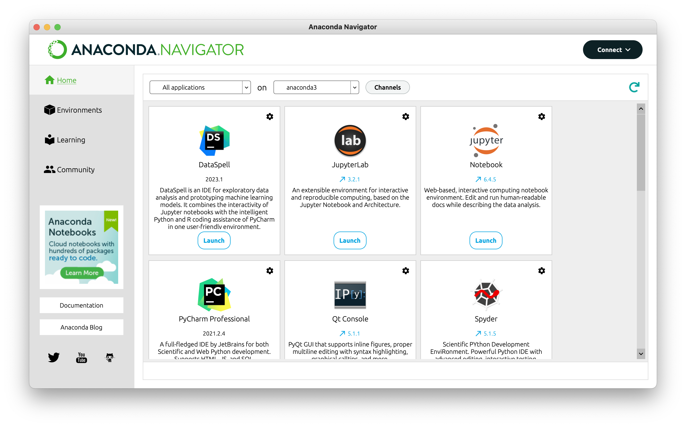
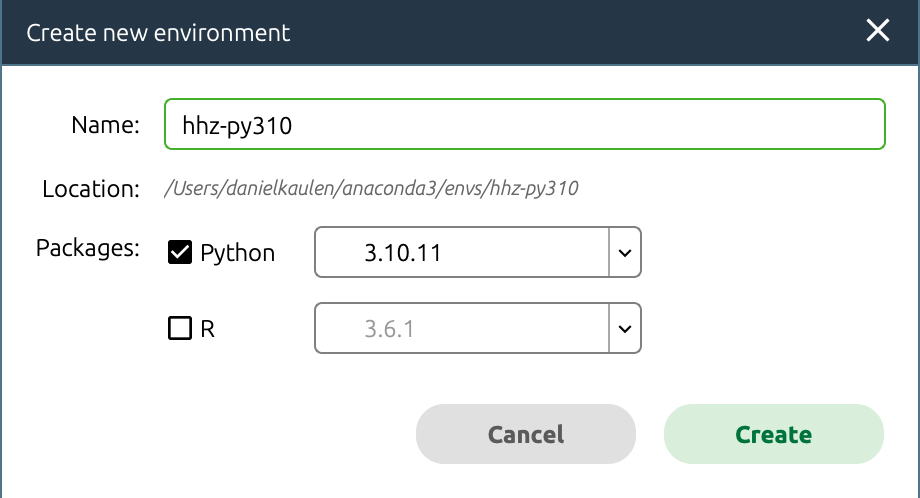
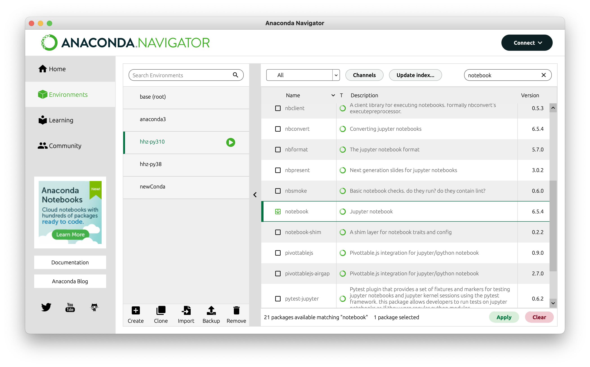
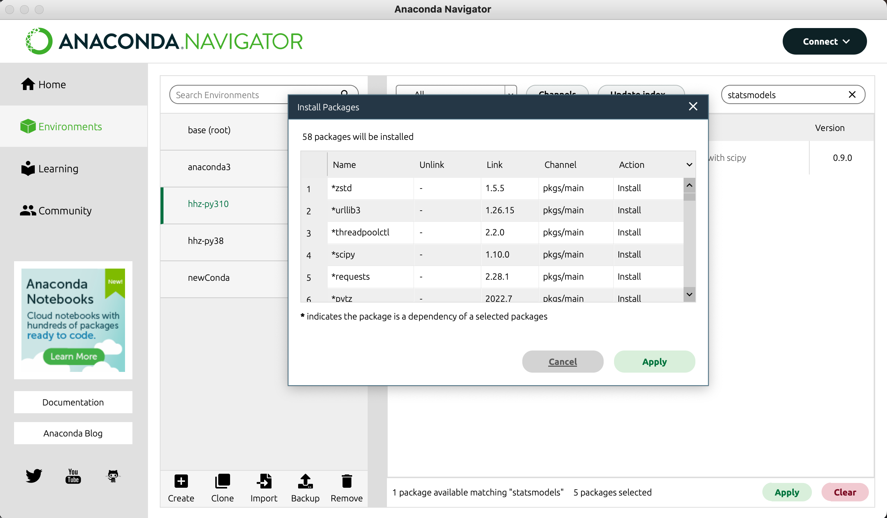

# How can I work with Jupyter notebooks locally?

Note: There are multiple ways to work with [Jupyter](https://jupyter.org/) notebooks and manage Python environments on your local machine. This guideline describes the _recommended_ setup for the accompanying exercises of the Artificial Intelligence course.

1. Download, install and launch the latest version of [Anaconda Individual Edition](https://www.anaconda.com/download)

2. Create a new conda environment and install required packages (use the latest available versions).

  - The required packages will vary between exercises. Install at least `notebook`, `pandas`, `scikit-learn` and `matplotlib`, `seaborn`, `statsmodels`.

  - Click apply and wait for the installation to finish.

  - For some exercises, we may provide a predefined environment file (e.g. [env-hhz-py310.yml](./env-hhz-py310.yml)) that simplifies the installation of required package dependencies and allows to setup reproducible environments across different work stations.

3. Launch notebook and run Python code

  - Either navigate to existing notebooks (`.ipynb` files), or create a new notebook as shown

